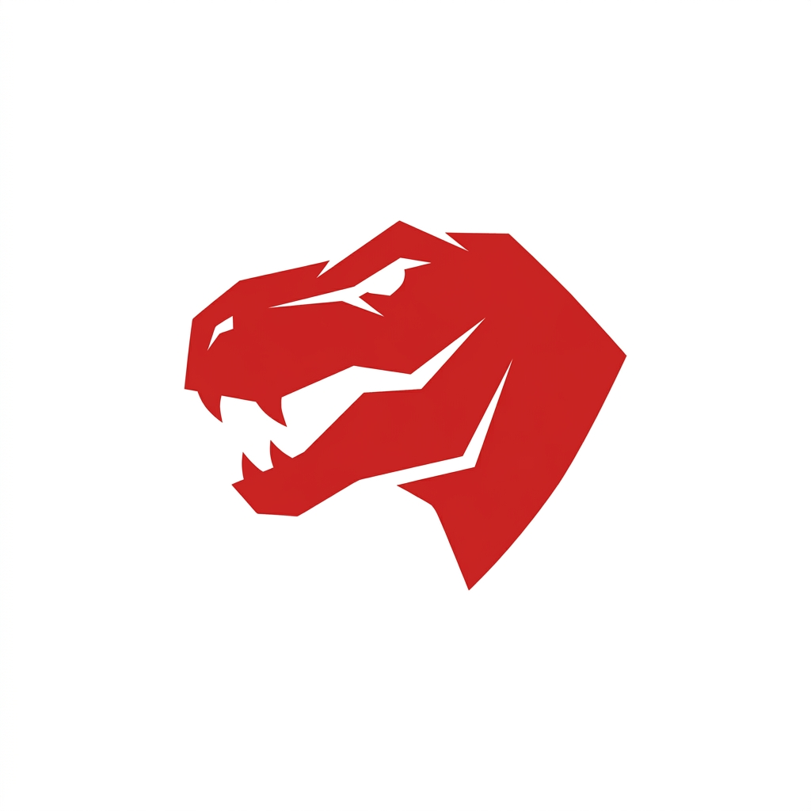

<<<<<<< HEAD
# 🦖 Gym - Management System

<div align="center">
  
  <p><strong>Sistema Integral de Gestión para Gimnasios y Centros Deportivos</strong></p>
  
  
  
  
  
</div>

---

## 📋 Sobre el Proyecto

**Gym - Management System** es una aplicación web robusta diseñada para centralizar y optimizar la administración de gimnasios. Este sistema permite gestionar desde el control de acceso mediante códigos QR hasta el seguimiento financiero y de inventario, todo bajo una interfaz moderna, minimalista y de alto rendimiento.

> [!NOTE]
> Este es un proyecto personal desarrollado con fines de práctica y demostración técnica. No está destinado a la venta comercial y es propiedad intelectual del autor.

## ✨ Características Principales

### 🔐 Seguridad y Autenticación
- **Sistema de Roles:** Acceso diferenciado para administradores y usuarios.
- **Seguridad Robusta:** Implementación de JWT (JSON Web Tokens), encriptación de contraseñas con bcryptjs y protección contra ataques comunes mediante Helmet y Rate Limiting.

### 👥 Gestión de Socios
- **Registro Detallado:** Control total sobre la información de los miembros y el estado de sus membresías.
- **Control de Acceso QR:** Generación y validación de códigos QR únicos para cada socio, permitiendo un check-in rápido y automatizado.

### 💰 Finanzas e Inventario
- **Punto de Venta (POS):** Gestión de ventas de productos y suplementos integrada.
- **Control de Stock:** Seguimiento en tiempo real de productos disponibles.
- **Reportes:** Visualización de métricas clave sobre ingresos y visitas.

### 🎨 Experiencia de Usuario (UI/UX)
- **Diseño Premium:** Estética oscura ("Dark Mode") con acentos en rojo, utilizando técnicas de *glassmorphism* y animaciones fluidas.
- **Responsive:** Totalmente adaptado para su uso en computadoras, tablets y dispositivos móviles.

## 🛠️ Stack Tecnológico

- **Frontend:** HTML5, CSS3 (Vanilla), JavaScript ES6+.
- **Backend:** Node.js, Express.js.
- **Base de Datos:** PostgreSQL (alojado en Supabase).
- **Herramientas de Seguridad:** CORS, Helmet, express-rate-limit.
- **Otras Librerías:** UUID para identificadores únicos y QRcode para la generación de accesos.

## 🚀 Instalación y Configuración

### Pre-requisitos
- [Node.js](https://nodejs.org/) (v14 o superior)
- Una instancia de [PostgreSQL](https://www.postgresql.org/) o un proyecto en [Supabase](https://supabase.com/).

### Pasos a seguir

1. **Clonar el repositorio:**
   ```bash
   git clone <url-del-repositorio>
   cd gym-management
   ```

2. **Instalar dependencias:**
   ```bash
   npm install
   ```

3. **Configurar variables de entorno:**
   Crea un archivo `.env` en la raíz del proyecto basándote en la siguiente estructura:
   ```env
   PORT=3000
   DATABASE_URL=tu_cadena_de_conexion_postgresql
   JWT_SECRET=una_clave_secreta_muy_segura
   NODE_ENV=development
   ```

4. **Inicializar la Base de Datos:**
   ```bash
   npm run seed
   ```

5. **Iniciar el servidor:**
   ```bash
   # Modo desarrollo
   npm run dev

   # Modo producción
   npm start
   ```
   
## 📜 Licencia y Propiedad

Este proyecto es de carácter **privado y personal**.
- **Propiedad:** Todos los derechos reservados por el autor.
- **Uso:** Queda prohibida su distribución, venta o uso comercial sin autorización previa.
- **Propósito:** Portafolio personal y experimentación técnica.

---

  Desarrollado por Santiago Martin
>>>>>>> 69fbb6c9ef94c9c6811642dab15179657cc018b0
</div>
